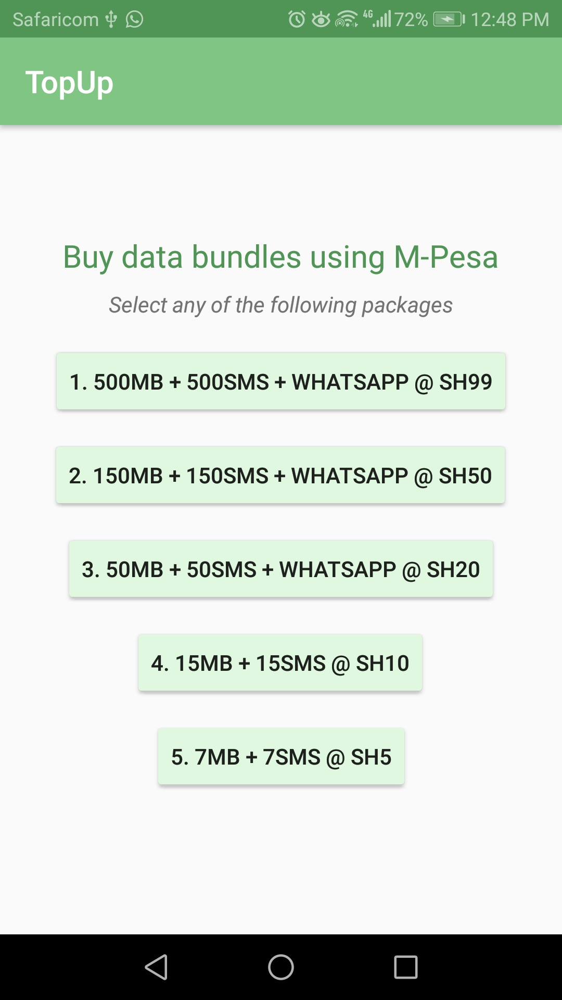
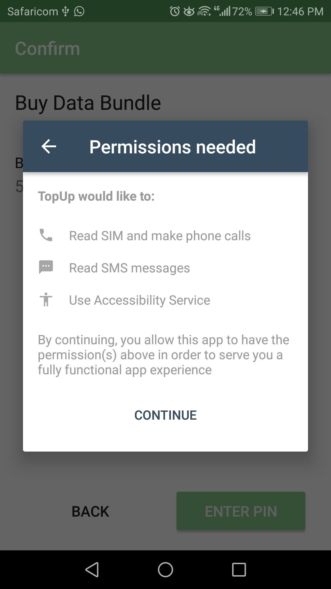
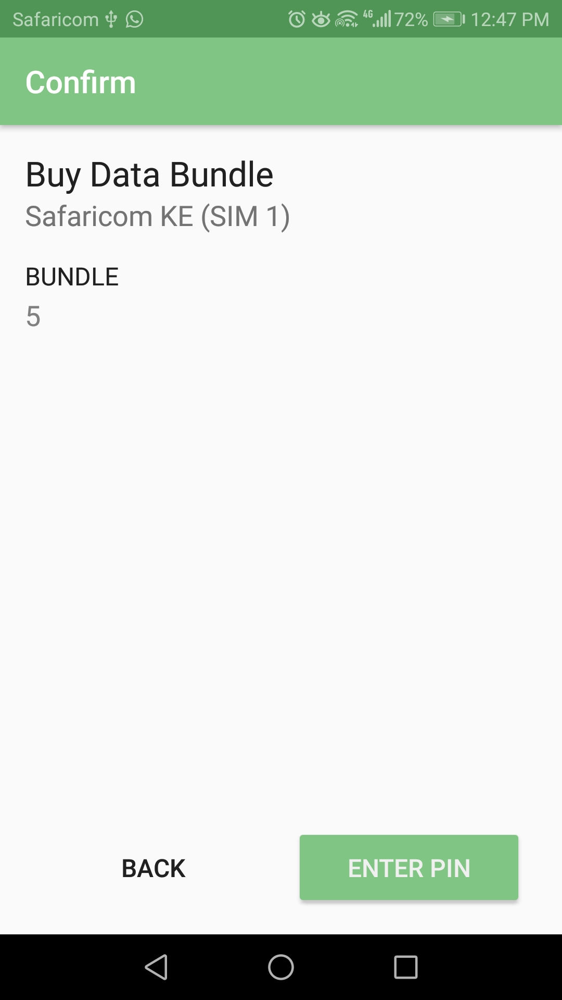
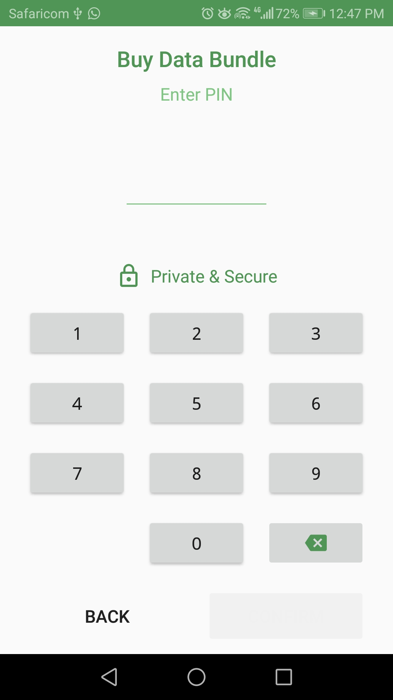

# TopUp
A simple mobile application using Hover SDK to buy Safaricom Daily data Bundles.

## Screenshots

      

## Meta
- Author: *Initial work* - **[Phena M.](https://github.com/PhenaMwema)**
- Status: Complete, subject to updates
- Version v1.0

## Resources
- [Hover SDK](https://usehover.com)
- [Android Developers](developer.android.com)
- [Google Developers](developers.google.com)

